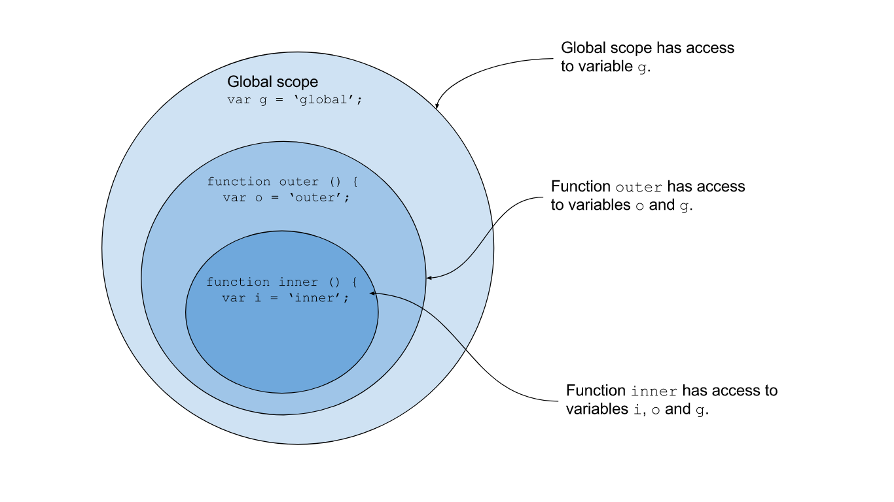

# JS Note

## 1. DOM basic
<https://www.w3schools.com/cssref/css_selectors.asp>
<https://www.w3schools.com/js/js_htmldom.asp>

1.1 The script dat o tren head va o body

```js
<script src="index.js"></script>
```

1.2. Su dung window.onload

1.3. Phan biet HTMLCollection va Array
Cac ham getElements... thi se tra ve loai HTMLCollection
Rieng ham document.getEleementById thi se tra ve 1 element

1.4. Thao tac voi 1 doi tuong trong DOM

Properties va methods cua 1 element object trong DOM (JS)

<https://www.w3schools.com/jsref/dom_obj_all.asp>

1.5. Element va NOde trong JS

Element la 1 DOM Obj bat dau bang <>
Node la 1 DOM Obj <> hoac la text node
Text cung la 1 node

1.6. Exercise:

Building a +-*/ with 2 inputs

## Day 02 Dealing with the function

2.1. Prevent Default

2.2. Faulty Truth Truthy Truth

"" NaN null undefined -> convert qua boolean la false

2.3. Cach dung return

Khi cau lenh js gap return -> se thoat khoi cau lenh (quit function

2.4. Cach khai bao function va su dung window.onload

```js
function onMinus() {
 window.event.preventDefault();
 var input1 = parseFloat(document.getElementById('input1').value);
 var input2 = parseFloat(document.getElementById('input2').value);
 var output = document.getElementById('output');
 output.innerText = input1 - input2;
 console.log(input1, input2);
}
```

2.5. 1 so luu y ve data type cua JS

- Ep kieu
  - '1' + 1 -> '11'
  - parseInt('1') + 1 -> 2

2.6. Luu y ve function

Cac ham khong co return thi se tra ve undefined
Khi gap tu khoa return thi ham se dung lai khong thuc thi nua

1 ham thi chi nen tu 15 -> 20 (10 -> 15) dong code
1 ham chi thuc hien 1 chuc nang nhat dinh (ko lam nhieu viec
Dat ten ham phai co y nghia va the hien dung chuc nang ma ham do xu ly

<https://www.w3schools.com/js/js_functions.asp>

** Cach dat ten ham: 2 cach (Naming Function Convention)

- Camel Case: onAddDefaultFunction
- C#: OnAddDefFunction
- SQL: on_add_def_func

2.7. Xu ly merge conflict

- git pull ve de biet merge conflict o dau
- nhung file bi conflict thi hien mau tim (C)
- click vao nhung file do ->
  - Accept Current Change: Giu thay doi cua minh
    - Accept Incomming Change: Lay thay doi tu remote
    - Accept Both Change: Giu ca 2 thay doi
- Xu ly xogn thi bam (+) de stage change lai
- git add .
- git commit -m "ten commit"
- git push

2.8. Khi bi refusing to merge unrelated histories

```bash
git pull --allow-unrelated-histories
```

## Day 3: Scope + Scope Chain + Object + Prototype Chain

### 1. Scope
Là phạm vi mà chương trình nhìn thấy 1 biến.

### 2. Scope Chain
Khi chương trình không tìm thấy 1 biến trong execution context hiện tại thì nó sẽ tìm ở môi trường ngoài nó (ra function bên ngoài, hoặc ra global context)



### 3. Object
#### 3.1. Định nghĩa
Tất cả trong javascript đều là object (trừ kiểu dữ liệu nguyên thủy string, number)
Do đó function cũng là obj nên mới khai báo kiểu function lồng trong function được. Ví dụ thế này:

```js
function func1() {
	var b = 'b';
	function func2() {
		var c = 'c';
		console.log(a, b, c, d);
	}
	func2();
}
```

#### 3.2. Cách khai báo Object trong JS
Có 2 cách khai báo trong ES5 (ES6 có thêm 1 cách nữa)

C1. Object Literals

```js
var Cho = {
  chan: 4,
  chay: function() {
    console.log('Cho Chay!')
  }
}
```

C2. Khai báo bằng Constructor Function

```js
function Cho() {
	this.chan = 4;
	// this.chay = function() {
	// 	console.log('cho chay!');
	// };
}
```

>*** Note: - Khi khai báo bằng Constructor Function thì sẽ sử dụng được prototype để thực hiện kế thừa trong JS
>
>```js
>Cho.prototype.sua = function() {console.log('Gau Gau')}
>```
>
>          - Khi khai báo hàm trong prototype kiểu này thì sẽ tiết kiệm bộ nhớ lưu trữ vì 1 hàm này sẽ sử dụng chung cho tất cả instance được khởi tạo bởi object này.
>          - Giả sử tạo 10.000 instances bằng new Cho() thì chỉ có 1 hàm sua() thôi nếu dùng prototype. Còn nếu tạo bằng Object literals xong rồi dùng Object.create(Cho) thì cũng có thể tạo được 10.000 instances nhưng hàm chay() khai báo trong đó sẽ bị nhân lên 10k lần -> tốn dung lượng lưu trữ.

#### 3.3. Sử dụng prototype để kế thừa và Prototype Chain trong JS

Cách kế thừa 1 lớp khác sử dụng prototype

```js
function ChoVN () {
  var mauLong = 'vang'
}

ChoVN.prototype = new Cho();

var thor = new ChoVN()
```

Khi kế thừa bằng cách này thì lớp ChoVN sẽ kế thừa thuộc tính và phương thức từ lớp Cho.

Khi đó nếu thor.chan để lấy thuộc tính chan thì chương trình sẽ tìm theo 1 cái gọi là Prototype Chain để truy ngược các lớp cha tìm xem có thuộc tính đó ko.


#### 3.4. Lưu ý về function lồng trong function (Closure)

Đối với trường hợp sử dụng function lồng trong function thuật ngữ gọi là Closure.
<https://developer.mozilla.org/en-US/docs/Web/JavaScript/Guide/Functions>

1 hàm là closure thì sẽ có thể truy cập biến của hàm chứa nó.

Cách sử dụng là như ví dụ bên dưới: Khai báo func2 lồng trong func1 rồi return func2.

Sau đó muốn gọi func2 thì gọi bằng cách func1()();

Ví dụ bên dưới là có parameter truyền vào.

```js
function outside(x) {
  function inside(y) {
    return x + y;
  }
  return inside;
}
fn_inside = outside(3); // Think of it like: give me a function that adds 3 to whatever you give
                        // it
result = fn_inside(5); // returns 8

result1 = outside(3)(5); // returns 8
```

*** Phần này giải thích technical hơn xíu về cơ chế của closure (đọc khi nào trình cao hơn rồi sẽ hiểu)

Extra1: Lý giải về vấn đề vì sao func2 (closure ở trong func1) vẫn có thể truy cập biến của func1 dù execution context của func1 đã được pop khỏi stack.

Trong ví dụ ở trên thì ta sẽ thấy là outside() được gọi 1 lần để gán vào fn_inside. Về mặt lý thuyết khi gọi xong outside() thì execution context của outside sẽ không còn nữa nhưng các biến khai báo trong outside vẫn còn nằm trong scope chain của outside và được lưu vào địa chỉ bộ nhớ (RAM).

Cơ chế dọn rác (Garbage Collection) của JS khi dọn dẹp biến lưu trữ trong bộ nhớ là: chỉ xóa địa chỉ biến khi địa chỉ biến đó hoàn toàn ko có code nào tham chiếu tới. Ở đây mình gọi tiếp fn_inside(5) tức nó đã tham chiếu tới hàm inside() trong outside(). Do đó các biến x, y của hàm này vẫn có thể sử dụng được.

Extra2: Closure được sử dụng khi nào.

Thực tế thì closure khá là private vì chỉ có hàm bao nó mới gọi và sử dụng được nó. Do đó nó được sử dụng để làm 1 helper method (phương thức hỗ trợ) cho việc tính toán trong hàm chính (khi cần tính toán phức tạp).

**BÀI VỀ NHÀ***

Làm 1 form input nhận vào giá trị trường, khoa, tên sinh viên, tuổi sinh viên. Khi nhập xong bấm submit thì bên table sẽ hiển thị đủ 4 trường thông tin + 1 cột số thứ tự.

Gợi ý: Sử dụng biến toàn cục để lưu mảng sinh viên. Khi submit form thì lưu giá trị dạng obj vào mảng này rồi có hàm thêm 1 dòng mới vào table hiện tại.

## Day 05: METHODS USING ON ARRAYS

### 1. Array.prototype.filter()

```js
var numArr = [1,2,3,4,5,6,7,8,9,10, 'a', 'b', 'c', 'd']
var filterArrNum = numArr.filter((el) => {return typeof el ==='number'})
filterArrNum.filter(el => el%2)
filterArrNum.filter(el => el%2===0)

var filterArrStr = numArr.filter((el) => {return typeof el ==='string'})
```

### 2. Lưu ý khi filter hay copy mảng (deep copy hay shallow copy - reference)

```js
filterArrNum[0] = 100000 //[100000, 2, 3, 4, 5, 6, 7, 8, 9, 10]

var copyArr = [...filterArrNum] //Sử dụng spread (ES6) để deep copy mảng

copyArr[0] = 'bad' //["bad", 2, 3, 4, 5, 6, 7, 8, 9, 10]

```

```js
const companies = [
    {name: "Company One", category: "Finance", start: 1981, end: 2003},
    {name: "Company Two", category: "Retail", start: 1992, end: 2008},
    {name: "Company Three", category: "Auto", start: 1999, end: 2007},
    {name: "Company Four", category: "Retail", start: 1989, end: 2010},
    {name: "Company Five", category: "Technology", start: 2009, end: 2014},
    {name: "Company Six", category: "Finance", start: 1987, end: 2010},
    {name: "Company Seven", category: "Auto", start: 1986, end: 1996},
    {name: "Company Eight", category: "Technology", start: 2011, end: 2016},
    {name: "Company Nine", category: "Retail", start: 1981, end: 1989},
];

companies.filter(el => el.category === 'Finance')

companies[0].hasOwnProperty('name') //true


```


### 3. Array.prototype.find()

<https://developer.mozilla.org/en-US/docs/Web/JavaScript/Reference/Global_Objects/Array/find>

>**Syntax**
>arr.find(callback(element[, index[, array]])[, thisArg])

```js
var todoList = [{name: 'Lam viec so 1', status: 1, id: 1}, {name: 'Lam viec so 2', status: 0, id: 2}]

todoList.find(todo => todo.id == 1) // -> object 1

todoList.find(todo => todo.id == 3) // -> undefined
```

Bên cạnh find() trả về phần tử mảng tìm được (hoặc undefined nếu ko tìm được) thì có hàm findIndex() trả về index (vị trí) của phần tử trong mảng.
findIndex() thì trả về phần tử đầu tiên tìm được (chứ ko phải là nhiều phần tử tìm được)

```js
companies.findIndex(nv => nv.category === 'Finance') // Trả về là 0
```

### 4. Array.prototyp.push()

Chú ý thì push trả về độ dài của mảng

```js
var newArr = numArr.push('asdf')
newArr // 16 chứ ko phải là mảng như [1,2,3,5]
```

### 5. Array.prototype.splice()

Xóa phần tử ở vị trí index trong mảng, hoặc nếu số phần tử cần xóa = 0 thì sẽ insert thêm phần tử vào thông qua arg thứ 3 truyền vào

```js
const months = ['Jan', 'March', 'April', 'June'];
months.splice(1, 0, 'Feb');
// inserts at index 1
console.log(months); // ["Jan", "Feb", "March", "April", "June"] Feb được insert vào
```

```js
var idx = companies.findIndex(nv => nv.category === 'Retail')
companies.splice(idx, 1)
```

### 6. Tổng hợp những hàm ko quan trọng lắm

```js
companies.forEach(el => console.log(el))

'Nguyen Quang Hieu'.includes('Nguyen')

'Nguyen Quang Hieu'.indexOf('Quang') // 7 || Nếu trả về -1 tức là ko có phần tử trong mảng

companies.sort((a,b) => a.start - b.start) // Sort từ thấp đến cao theo object

companies.sort((a,b) => b.start - a.start) 

```

### 7. Array.prototyp.map() + Array.prototype.reduce()